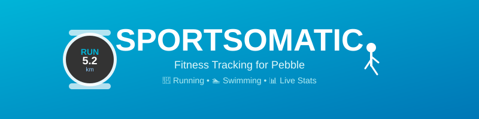
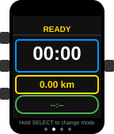
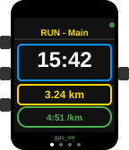
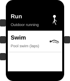
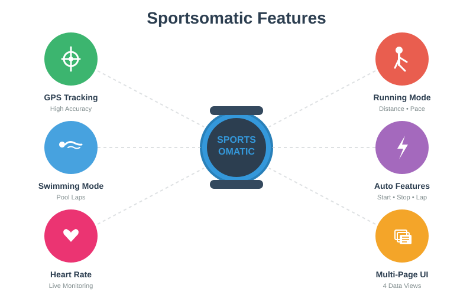
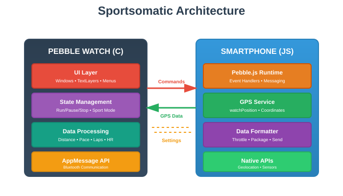

# Sportsomatic

A comprehensive fitness tracking app for Pebble smartwatches that supports both running and swimming activities with GPS tracking and real-time statistics.



## Features

### 🏃 Running Mode
- **GPS Tracking**: Real-time location tracking with high accuracy
- **Live Statistics**: 
  - Elapsed time
  - Distance (km/miles)
  - Current pace
  - Lap times and splits
- **Auto Features**:
  - Auto-start when movement detected
  - Auto-stop after 15 seconds of inactivity
  - Auto-lap at configurable distances
- **Distance Alerts**: Vibration notifications at every kilometer/mile
- **Heart Rate Monitoring**: Display current heart rate (on compatible devices)

### 🏊 Swimming Mode
- **Pool Swimming**: Optimized for pool-based swimming
- **Lap Tracking**: Manual lap button or automatic lap counting
- **Configurable Pool Length**: Support for 25m, 50m, 25yd pools
- **Statistics**:
  - Total time
  - Distance (meters/yards)
  - Lap count
  - Pace per 100m/100yd

### 📊 Multiple Views
Navigate through different data screens during your workout:
- **Main View**: Time, distance, and pace
- **Lap View**: Current lap statistics
- **Heart Rate View**: Real-time heart rate data
- **Splits View**: Historical lap information

### ⚙️ Customizable Settings
- **Units**: Switch between metric (km) and imperial (miles)
- **Auto-lap**: Enable/disable and configure distance
- **Distance Alerts**: Toggle vibration alerts
- **Sport Mode**: Easy switching between Run and Swim modes
- **Pool Length**: Customize pool length for swimming

## Screenshots

<table>
  <tr>
    <td></td>
    <td></td>
    <td></td>
  </tr>
  <tr>
    <td align="center"><b>Ready Screen</b></td>
    <td align="center"><b>Running Mode</b></td>
    <td align="center"><b>Sport Selection</b></td>
  </tr>
</table>

### Feature Overview



### Architecture



The app uses a two-part architecture:
- **Watch-side (C)**: Handles UI, state management, distance calculations, and lap tracking
- **Phone-side (JavaScript)**: Manages GPS tracking and forwards location data to the watch via Bluetooth

## Installation

### Prerequisites
- [Pebble SDK 3.0+](https://developer.rebble.io/developer.pebble.com/sdk/index.html)
- Python 2.7 (for Pebble SDK)
- Node.js (for JavaScript components)

### Building from Source

1. **Clone the repository**
   ```bash
   git clone https://github.com/bruhdev1290/sportsomatic.git
   cd sportsomatic/sportsomatic
   ```

2. **Install dependencies**
   ```bash
   pebble build
   ```

3. **Install to your watch**
   ```bash
   pebble install --phone <PHONE_IP>
   ```
   Or use CloudPebble to build and install.

### Installing Pre-built Package
Download the latest `.pbw` file from the [Releases](https://github.com/bruhdev1290/sportsomatic/releases) page and install it using the Pebble mobile app.

## Usage

### Getting Started

1. **Launch the app** on your Pebble watch
2. **Select your sport** (Run or Swim) using the menu
3. **Press SELECT** to start tracking
4. **During workout**:
   - Press UP to manually mark a lap (running mode)
   - Press DOWN to cycle through data views
   - Press SELECT to pause/resume
   - Hold BACK to end the workout

### Controls

| Button | Action | Long Press |
|--------|--------|------------|
| **SELECT** | Start/Pause/Resume | Change sport mode |
| **UP** | Mark lap (Run mode) | - |
| **DOWN** | Switch view | - |
| **BACK** | Show tip | End workout |

### Running Mode

The app automatically starts tracking when it detects movement (configurable). GPS data is continuously sent to the watch, tracking:
- Distance traveled using Haversine formula
- Current speed and pace
- Automatic lap marking at each km/mile

### Swimming Mode

Optimized for pool swimming where GPS is not reliable:
- Each lap button press increments distance by pool length
- Automatic lap tracking based on configured pool length
- Shows total laps, distance, and pace per 100m/yd

## Technical Details

### Architecture

```
sportsomatic/
├── src/
│   ├── c/
│   │   └── myfirstproject.c    # Watch-side C code
│   └── pkjs/
│       └── index.js             # Phone-side JavaScript
├── package.json                 # App metadata
└── wscript                      # Build configuration
```

### Platform Support
- Pebble Aplite (black & white)
- Pebble Basalt (color)
- Pebble Chalk (round, color)
- Pebble Diorite (black & white)
- Pebble Emery (larger, color)

### Communication Protocol
The app uses Pebble's AppMessage API to communicate between the watch and phone:
- **Watch → Phone**: Commands (START, PAUSE, RESUME, STOP), settings
- **Phone → Watch**: GPS coordinates, speed, accuracy, status messages

### GPS Accuracy
- High accuracy mode enabled
- Position updates throttled to 1 second intervals
- Filters positions with accuracy > 50m
- Uses Haversine formula for distance calculation

## Development

### Project Structure
- **C Code** (`src/c/`): Watch-side application logic, UI rendering, and state management
- **JavaScript** (`src/pkjs/`): Phone-side GPS tracking and message routing
- **Build System**: WAF-based build system via `wscript`

### Key Features Implementation
- **GPS Tracking**: Haversine distance calculation between coordinate pairs
- **Auto-start/stop**: Movement detection based on speed and position delta
- **Multi-page UI**: State machine for different data views
- **Sport Modes**: Configurable behavior for running vs swimming
- **Heart Rate**: Integration with Pebble Health API (on compatible devices)

### Building
```bash
pebble build
```

### Testing
Test on emulator:
```bash
pebble install --emulator <platform>
```

Platforms: `aplite`, `basalt`, `chalk`, `diorite`, `emery`

## Contributing

Contributions are welcome! Please feel free to submit a Pull Request.

1. Fork the repository
2. Create your feature branch (`git checkout -b feature/AmazingFeature`)
3. Commit your changes (`git commit -m 'Add some AmazingFeature'`)
4. Push to the branch (`git push origin feature/AmazingFeature`)
5. Open a Pull Request

## License

This project is open source. Please check the repository for license information.

## Credits

**Author**: MakeAwesomeHappen (bruhdev1290)

## Support

For issues, questions, or suggestions, please open an issue on the [GitHub repository](https://github.com/bruhdev1290/sportsomatic/issues).

---

**Note**: This app requires the Pebble mobile app and a compatible Pebble smartwatch. Since Pebble's official services were discontinued, you'll need to use [Rebble](https://rebble.io/) services to use the app.
